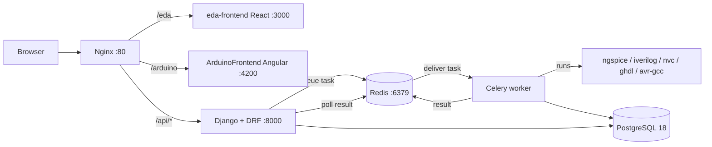
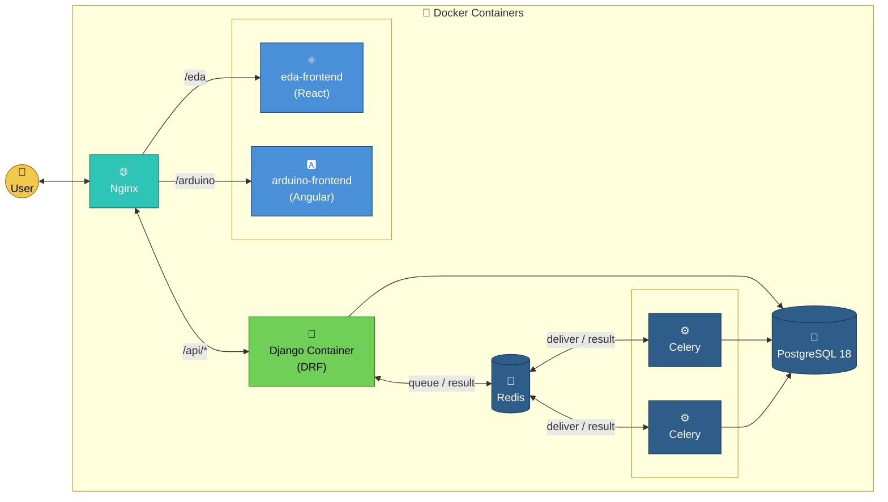

<h1 align="center"> 
eSim and Arduino on Cloud 
</h1>
<h6 align="center"> 

<!-- ALL-CONTRIBUTORS-BADGE:START - Do not remove or modify this section -->
[](#contributors-)
<!-- ALL-CONTRIBUTORS-BADGE:END -->

[](https://esim-cloud.readthedocs.io/en/latest/?badge=latest)
[](https://discord.gg/cZbDD8K)

[](https://www.codefactor.io/repository/github/frg-fossee/esim-cloud)
[](https://img.shields.io/badge/PRs-welcome-important)


[Quick Start](#quick-start) | [Architecture](#how-the-system-works--architecture) | [API Docs](#api-documentation-swagger) | [Contributing](#contributing) | [Credits](#contributors-)
</h6>

---

**eSim-Cloud** is a browser-based Electronic Design Automation (EDA) platform. It lets anyone — students, teachers, hobbyists — draw electronic circuits, simulate them on real open-source engines (ngspice, Icarus Verilog, NVC/GHDL, avr-gcc) running in the cloud, and share the results. No local tool installation is needed by end users; everything runs inside Docker containers behind a single Nginx entry point.

## Table of Contents

- [What can it do?](#what-can-it-do)
- [Quick Start](#quick-start)
- [How the system works — Architecture](#how-the-system-works--architecture)
  - [The big picture](#the-big-picture)
  - [The asynchronous simulation pipeline](#the-asynchronous-simulation-pipeline)
  - [Backend Django apps, one by one](#backend-django-apps-one-by-one)
  - [The save model: versions, branches, sharing](#the-save-model-versions-branches-sharing)
  - [Publishing & moderation workflow](#publishing--moderation-workflow)
  - [LTI: running eSim inside an LMS](#lti-running-esim-inside-an-lms)
  - [Frontends](#frontends)
- [API Documentation (Swagger)](#api-documentation-swagger)
- [Repository layout](#repository-layout)
- [Development guide](#development-guide)
- [Tech stack](#tech-stack)
- [Contributing](#contributing)
- [Contributors ✨](#contributors-)

## What can it do?

| Feature | Where | Engine |
|---------|-------|--------|
| Draw analog/digital schematics (drag-drop KiCad symbols, wires, ERC check, print/PDF export) | eSim editor (`/eda/#/editor`) | React + SVG canvas |
| Simulate circuits: DC solver, DC sweep, Transient, AC analysis | eSim editor / SPICE IDE (`/eda/#/simulator/ngspice`) | **ngspice** on Celery workers |
| Write & simulate Verilog / SystemVerilog / VHDL with a waveform viewer | HDL IDE (`/eda/#/simulator/hdl`) | **Icarus Verilog**, **NVC** |
| Drag-drop Arduino boards, LEDs, motors, write sketches, simulate in-browser | Arduino app (`/arduino`) | **avr-gcc** (cloud compile) + **AVR8js** (browser execution) |
| Save circuits with versions & branches (git-like history) | Dashboard | Django + PostgreSQL |
| Share circuits by link, publish to public gallery/projects with review workflow | Gallery / Projects | Django |
| Embed graded circuit assignments in Moodle or any LMS | LTI integration | LTI 1.x grade passback |
| AI assistant that explains ngspice errors | Chat widget in the editor | Ollama / Gemini / rule-based fallback |

### eSim on Cloud
Users drag and drop components from the left pane onto the schematic grid, wire them up, run ERC checks and simulate with different analyses (DC Solver, DC Sweep, Transient, AC). Grid size goes from A1 to A5, portrait or landscape, and circuits can be printed or exported to PDF.


### Arduino on Cloud
Users drag and drop Arduino boards and peripherals (LED, motor, push button, ...), wire pins, write sketch code in the code window and simulate. Wire/LED colors are configurable, ERC checks catch mistakes, and the design can be printed or exported to PDF.


## Quick Start

One-time setup (all platforms need [Docker](https://docs.docker.com/desktop/); Windows additionally needs WSL — run `wsl --install` in an admin PowerShell, restart, then use the Ubuntu app as your terminal, **not** PowerShell):

```bash
git clone https://github.com/<yourGitHubUserName>/eSim-Cloud.git   # fork first, all branches
cd eSim-Cloud
git checkout develop
/bin/bash first_run.dev.sh        # builds all images, seeds DB — ~40 min on first run
```

Start the development stack:

```bash
docker-compose -f docker-compose.dev.yml --env-file .env up
```

Then open:

| URL | What |
|-----|------|
| http://localhost/ | Landing page (launch eSim / Arduino) |
| http://localhost:3000/ | eSim React frontend (direct, hot-reload) |
| http://localhost:4200/ | Arduino Angular frontend (direct, hot-reload) |
| http://localhost:8000/api/docs | **Swagger UI — interactive API documentation** |
| http://localhost/api/admin | Django admin (`admin` / `admin`) |
| http://localhost/admin | Account console — password-gated, see [below](#the-admin-account-console) |

Default login: username `admin`, password `admin`.

#### The admin account console

`/admin` is a standalone operator panel for listing, creating, deleting and
OTP-approving user accounts. It is **not** tied to any application account —
no user, however privileged, can reach it by logging into the site. Entry
requires a single panel password of its own.

On a fresh deployment no password exists yet, so the panel opens only for
whoever can read the server, via a one-time bootstrap token:

```bash
docker exec -it <django-container> python3 manage.py admin_setup_token
```

Enter that token at `/admin/setup/` together with the password you want.
Setup is one-shot: the token is destroyed the moment a password is set and
`/admin/setup/` returns 404 from then on. Afterwards `/admin` is reachable
only with the password, and five wrong guesses lock the panel for 15 minutes.

Lost the password? Reset it from a shell — the deliberate recovery path:

```bash
docker exec -it <django-container> python3 manage.py set_admin_password
docker exec -it <django-container> python3 manage.py set_admin_password --clear  # back to first-time setup
```

Production stack:

```bash
cp .env .env.prod                 # first time only, then edit secrets
docker-compose -f docker-compose.prod.yml --env-file .env.prod up
```

If sample circuits or components are missing after first start, apply migrations manually:

```bash
docker ps                                  # find the django container id
docker exec -it <ContainerID> /bin/bash
sh migrations.sh
```

## How the system works — Architecture

### The big picture

Seven containers cooperate. Nginx is the only public entry point in production; in dev the frontends also expose their own ports for hot reload.



The single most important design decision to understand: **the Django request/response cycle never runs a simulation.** Simulations and compilations are CPU-heavy and can hang (ngspice can even segfault on a bad netlist), so they are pushed to Celery workers via Redis. Every "run something" endpoint returns a `task_id` immediately, and the client polls a status endpoint until the Celery state reaches `SUCCESS` or `FAILURE`. This keeps the web tier responsive and lets operators scale workers independently (`--scale celery=3`).

| Container | Image / source | Role |
|-----------|---------------|------|
| `nginx` | `nginx` + `Nginx/dev.conf.d` | Reverse proxy: routes `/api` → Django, `/eda` → React, `/arduino` → Angular; serves static files, uploaded schematics and KiCad symbol SVGs |
| `django` | `esim-cloud-backend/` | REST API (Django + Django REST Framework), auth, persistence |
| `celery` | same image as django | Executes simulation/compilation tasks; has ngspice, iverilog, nvc, ghdl, avr toolchain installed |
| `redis` | `redis` | Celery broker **and** result backend |
| `db` | `postgres:18` | All persistent data |
| `eda-frontend` | `eda-frontend/` | React SPA — schematic editor, SPICE & HDL IDEs, dashboard, gallery |
| `arduino-frontend` | `ArduinoFrontend/` | Angular SPA — Arduino designer + in-browser AVR8js simulator |

### The asynchronous simulation pipeline

Concrete walk-through of what happens when a user hits **Simulate** in the schematic editor:

1. **Netlist generation (browser).** The React editor walks the wired components on the canvas and generates a SPICE netlist (component lines, `.model`/`.lib` includes, and the analysis directive the user picked — `.tran`, `.ac`, `.dc` or `.op`).
2. **Upload.** The frontend `POST`s the netlist as a file to `/api/simulation/upload` (multipart). `simulationAPI.views.NetlistUploader` validates it via `TaskSerializer`, stores the file under `file_storage/`, and records the netlist text in the `simulation` history table (linked to the saved schematic and to the user, if logged in).
3. **Queueing.** The view calls `process_task.apply_async(...)` with the task UUID (optionally with a soft time limit configured through the `Limit` admin model) and immediately returns `{state, details: {task_id, ...}}`.
4. **Execution (Celery worker).** `simulationAPI/tasks.py:process_task` invokes `helpers/ngspice_helper.ExecNetlist`, which runs `ngspice -b` as a subprocess, captures stdout/stderr, and survives crashes (a netlist that segfaults ngspice produces a parsed error, not a hung request).
5. **Parsing.** On success, `helpers/parse.py` converts ngspice's text output into JSON graph points. On failure, `helpers/error_parser.py` maps raw ngspice errors ("singular matrix", "floating node", ...) to human-readable `error_help` hints — the same hints the AI chatbot falls back to.
6. **Polling.** Meanwhile the frontend polls `GET /api/simulation/status/<task_id>` every second. The view reads the Celery result from Redis; once `state == SUCCESS`, `details` holds the plot data and the frontend renders the waveform graphs.

The other execution flows are the exact same pattern with different engines:

| Flow | Upload endpoint | Poll endpoint | Worker toolchain |
|------|----------------|---------------|------------------|
| SPICE netlist | `POST /api/simulation/upload` | `GET /api/simulation/status/{task_id}` | ngspice |
| Single HDL file (schematic-driven) | `POST /api/simulation/hdl/upload` | `GET /api/simulation/status/{task_id}` | iverilog+vvp or ghdl → VCD |
| Multi-file HDL IDE | `POST /api/verilog/upload` (JSON sources + testbench) | `GET /api/verilog/status/{task_id}` | iverilog (`-g2012`) or nvc (VHDL) → VCD |
| Arduino sketch | `POST /api/arduino/compileINO` (or `compileInlineAssembly`) | `GET /api/arduino/compile/status?task_id=` | avr-gcc → Intel hex |

For HDL runs the worker parses the generated VCD file (`helpers/vcd_parser.py`) into per-signal change lists that the frontend waveform viewer (logic analyzer) renders. For Arduino, the compiled hex is returned to the browser and executed client-side by [AVR8js](https://github.com/wokwi/avr8js) — the cloud only compiles, the simulation itself runs in the user's browser.

### Backend Django apps, one by one

The backend (`esim-cloud-backend/`) is a single Django project `esimCloud` composed of focused apps. URL prefixes are wired in `esimCloud/urls.py`.

| App | URL prefix | Responsibility |
|-----|-----------|----------------|
| **authAPI** | `/api/auth/`, `/admin/` | Registration with e-mail OTP (`PendingUser` model → real `User` on activation), token login (DRF TokenAuth via [Djoser](https://djoser.readthedocs.io/)), Google OAuth2 callback, password reset; also serves the password-gated account console at `/admin/` (`admin_views.py`, `AdminAccess` model) |
| **simulationAPI** | `/api/simulation/` | SPICE + single-file HDL uploads, Celery task status, per-user/per-schematic simulation history, runtime statistics, admin-configurable task time limits |
| **simulationAPI (verilog)** | `/api/verilog/` | The HDL IDE backend: multi-file Verilog/SystemVerilog/VHDL compile & simulate, VCD results |
| **arduinoAPI** | `/api/arduino/` | Queue avr-gcc compilation of Arduino sketches (C++ or inline assembly) |
| **saveAPI** | `/api/save*` | Persist schematic state (`StateSave`: JSON `data_dump` + base64 preview image), list user saves, versions & branches, copy, share-by-link, gallery of sample circuits |
| **libAPI** | `/api/libraries`, `/api/library-sets`, `/api/components` | KiCad-derived component library: libraries, per-user library sets, searchable components with SVG symbols (generated by `generate_svg.sh` from `kicad-symbols/`), favourite components |
| **publishAPI** | `/api/publish/`, `/api/tags` | Turn saved circuits into public **Projects** with title/description/tags, project bundles, browse published projects |
| **workflowAPI** | `/api/workflow/` | Moderation around publishing: user roles, project state transitions (draft → review → published), reporting and resolving inappropriate projects |
| **ltiAPI** | `/api/lti/` | LTI tool provider: build an LTI app from a circuit, LMS launch auth, student submissions, grade passback to the LMS |
| **chatbotAPI** | `/api/chat/` | AI assistant: tries local Ollama, then Gemini (`GEMINI_API_KEY`), then a rule-based matcher for common ngspice errors. Never fails — always returns a reply |

Supporting pieces:

- `esimCloud/settings.py` — PostgreSQL connection, Celery broker/result = `redis://redis:6379`, installed apps, Djoser config.
- `file_storage/` — uploaded netlists/HDL files and saved images (served by Nginx).
- `kicad-symbols/` + `generate_svg.sh` — source symbol libraries and the script that renders them to SVGs used by the editor's component pane.
- `migrations.sh` — applies migrations and seeds sample data.

### The save model: versions, branches, sharing

`saveAPI.models.StateSave` is the heart of persistence. A circuit is identified by a `save_id` (UUID) and every save creates a **version**; versions can live on named **branches** — so a row is addressed by the triple `(save_id, version, branch)`, git-style. The row stores:

- `data_dump` — the full schematic as JSON (components, positions, wires, properties),
- `base64_image` — a PNG preview shown on the dashboard,
- flags for sharing (`shared` circuits are readable by anyone with the link) and ownership.

This triple shows up throughout the API (`/api/save/{save_id}/{version}/{branch}`, simulation history, LTI submissions). The gallery is a separate `Gallery` model holding curated sample circuits available to everyone.

### Publishing & moderation workflow

A user can publish a saved circuit as a `publishAPI.models.Project` (title, description, tags, optionally bundling several schematics). Publishing is gated by `workflowAPI`: users have roles, projects move through states (e.g. draft → submitted for review → published/rejected), reviewers see state-transition endpoints, and any published project can be *reported*; moderators list reports, approve or resolve them. This is what makes the public projects page safe for classroom use.

### LTI: running eSim inside an LMS

`ltiAPI` implements an LTI 1.x tool provider so an instructor can embed a specific circuit as a graded assignment in Moodle (or any LTI consumer):

1. Instructor picks a saved circuit and `POST /api/lti/build/` — gets consumer key/secret + a config URL (`/api/lti/{save_id}/config.xml/`).
2. The LMS launches students at `/api/lti/auth/{save_id}/`; the backend validates the OAuth signature and opens an `ltiSession`.
3. Student simulations are recorded against the session; on submit, `POST /api/lti/submit/` sends the grade back to the LMS (grade passback).
4. Instructors list submissions per circuit via `/api/lti/submissions/...`.

The Arduino app has a parallel set of `arduino/*` LTI endpoints.

### Frontends

**eda-frontend** (React, CRA) — the main eSim app, served under `/eda`:

- `src/pages/` — routed pages: `SchematiEditor` (the schematic editor), `Simulator` (`/simulator/ngspice` SPICE netlist IDE), `VerilogSimulator` (`/simulator/hdl` HDL IDE with waveform viewer), `Dashboard`, `Gallery`, `Projects`, `Login/signUp`, `LTISetup`, `SubmissionPage`, `CircuitViewer` (read-only share view).
- `src/components/SchematicEditor/` — the editor itself: component pane (fed by libAPI), SVG canvas with wiring + netlist DSU, properties sidebar, ERC, netlist generator.
- `src/components/LogicAnalyzer/` — VCD waveform rendering for HDL results.
- `src/redux/` — global state (auth token, save state, simulation results, ...). API calls go through `src/utils/` + `src/config/`; the auth token from `/api/auth/token/login/` is attached as `Authorization: Token <...>`.

**ArduinoFrontend** (Angular) — served under `/arduino`. Components are drawn with RaphaelJS; the wokwi **AVR8js** library executes the compiled AVR hex directly in the browser, driving simulated LEDs/motors in real time.

Both frontends talk to the backend exclusively through the REST API documented below — there is no other coupling, which is why you can develop a frontend against a running backend container alone.

## API Documentation (Swagger)

The backend self-documents with **drf-yasg** (OpenAPI 2.0). With the stack running:

| URL | What |
|-----|------|
| `http://localhost:8000/api/docs` | **Swagger UI** — browse every endpoint grouped by tag, see request/response schemas, and execute calls with *Try it out* |
| `http://localhost:8000/api/docs.json` | Raw OpenAPI spec (JSON) — import into Postman/Insomnia |
| `http://localhost:8000/api/docs.yaml` | Raw OpenAPI spec (YAML) |

Endpoints are grouped by tags: `auth`, `Simulation (ngspice)`, `Verilog HDL`, `Arduino`, `save`, `libraries`, `components`, `publish`, `workflow`, `lti`, `Chatbot`. Endpoints with a lock icon require the token header.

### Authenticating in 3 requests

```bash
# 1. Register — sends OTP e-mail (in dev without SMTP, OTP is echoed back)
curl -X POST http://localhost:8000/api/auth/users/ \
  -H 'Content-Type: application/json' \
  -d '{"username":"alice","email":"alice@example.com","password":"s3cret-pass"}'

# 2. Activate with the OTP
curl -X POST http://localhost:8000/api/auth/users/activation/ \
  -H 'Content-Type: application/json' \
  -d '{"email":"alice@example.com","token":"123456"}'

# 3. Get a token
curl -X POST http://localhost:8000/api/auth/token/login/ \
  -H 'Content-Type: application/json' \
  -d '{"username":"alice","password":"s3cret-pass"}'
# → {"auth_token":"...","user_id":1}
```

Use it on protected endpoints:

```bash
curl http://localhost:8000/api/save/list -H 'Authorization: Token <auth_token>'
```

### Running a simulation from the command line

```bash
# Upload a netlist
cat > rc.cir <<'EOF'
RC circuit
V1 in 0 DC 5
R1 in out 1k
C1 out 0 1u
.tran 10u 10m
.end
EOF
curl -X POST http://localhost:8000/api/simulation/upload -F file=@rc.cir
# → {"state":"PENDING","details":{"task_id":"<uuid>", ...}}

# Poll until SUCCESS
curl http://localhost:8000/api/simulation/status/<uuid>
```

## Repository layout

```
eSim-Cloud/
├── esim-cloud-backend/        # Django + DRF + Celery backend
│   ├── esimCloud/             #   project settings, root urls.py, celery app
│   ├── authAPI/               #   registration/OTP, token login, Google OAuth
│   ├── simulationAPI/         #   ngspice + HDL pipelines, helpers/, tasks.py
│   ├── arduinoAPI/            #   avr-gcc compile tasks
│   ├── saveAPI/               #   StateSave versions/branches, gallery
│   ├── libAPI/                #   KiCad component libraries
│   ├── publishAPI/            #   public projects
│   ├── workflowAPI/           #   roles, review states, reports
│   ├── ltiAPI/                #   LMS integration
│   ├── chatbotAPI/            #   AI assistant
│   ├── kicad-symbols/         #   symbol sources (+ generate_svg.sh)
│   └── file_storage/          #   uploaded netlists, images
├── eda-frontend/              # React SPA (eSim editor, SPICE & HDL IDEs)
├── ArduinoFrontend/           # Angular SPA (Arduino designer + AVR8js)
├── Nginx/                     # reverse-proxy configs (dev/prod) + landing page
├── docker-compose.dev.yml     # dev stack (hot reload, exposed ports)
├── docker-compose.prod.yml    # prod stack
├── first_run.dev.sh           # one-time bootstrap
├── docs/                      # Sphinx docs (readthedocs)
└── Examples/, demo/           # sample circuits, demo GIFs
```

## Development guide

Common commands (all from the repo root):

```bash
# Full dev stack
docker-compose -f docker-compose.dev.yml --env-file .env up

# Backend only (API on :8000) — enough for API/backend work
docker-compose -f docker-compose.dev.yml --env-file .env up django

# eSim frontend + backend / Arduino frontend + backend
docker-compose -f docker-compose.dev.yml --env-file .env up eda-frontend
docker-compose -f docker-compose.dev.yml --env-file .env up arduino-frontend

# Rebuild images after Dockerfile/requirements changes
docker-compose -f docker-compose.dev.yml --env-file .env build

# Restart nginx after config changes
docker-compose -f docker-compose.dev.yml --env-file .env restart nginx

# Backend shell / tests / migrations
docker exec -it <django-container> /bin/bash
python3 manage.py test              # inside the container
sh migrations.sh                    # inside the container

# Scale for load (production)
docker-compose -f docker-compose.prod.yml --env-file .env.prod up --scale django=2 --scale celery=3 -d
```

Source directories are volume-mounted into the containers, so backend edits auto-reload Django, and both frontends run their own dev servers with hot reload. **Celery does not auto-reload** — restart the `celery` container after changing task code (`tasks.py`, `helpers/`).

Handy notes:

- Port 80 busy? `sudo kill -9 $(sudo lsof -t -i:80)`
- Environment/secrets live in `.env` (dev) / `.env.prod` (prod) — DB credentials, OAuth keys, `GEMINI_API_KEY`, SMTP settings. See [CONFIG.md](CONFIG.md).
- CI (GitHub Actions) runs Django tests, React/Angular builds and ESLint on every PR — run them locally first.
- Long-form docs live on [esim-cloud.readthedocs.io](https://esim-cloud.readthedocs.io/).

### Where to start reading code

| I want to... | Start here |
|---------------|-----------|
| Understand a simulation end-to-end | `esim-cloud-backend/simulationAPI/views.py` → `tasks.py` → `helpers/ngspice_helper.py` |
| Change the schematic editor | `eda-frontend/src/components/SchematicEditor/` |
| Touch the HDL IDE | `eda-frontend/src/pages/VerilogSimulator.js` + `simulationAPI/verilog_views.py` |
| Add/modify an API endpoint | The app's `urls.py` + `views.py`, then check it appears in `/api/docs` |
| Change how circuits are saved | `saveAPI/models.py` + `saveAPI/views.py` |
| Work on Arduino simulation | `ArduinoFrontend/src/app/` + `arduinoAPI/` |

## Tech stack

* Simulation backends: **ngspice** (analog/mixed), **Icarus Verilog** & **NVC/GHDL** (HDL), **avr-gcc** (Arduino), [AVR8js](https://github.com/wokwi/avr8js) in-browser AVR simulator (MIT, credits [Uri Shaked](https://github.com/urish))
* Middleware: **Django**, **Django REST Framework**, **drf-yasg** (Swagger), **Djoser** (auth), **Celery**, **Redis**
* Frontends: **React** (Material-UI, Redux) and **Angular** (RaphaelJS)
* Database: **PostgreSQL 18** (MySQL supported via compose override)
* Infra: **Nginx**, **Docker / docker-compose**, GitHub Actions CI

## Docker Containers



## Contributing 
Want to contribute? See our [contributing guidelines](CONTRIBUTING.md). Contributions in any form are welcome.

A good first session: run the [Quick Start](#quick-start), open http://localhost:8000/api/docs, fire a simulation from Swagger's *Try it out*, then read the [pipeline walk-through](#the-asynchronous-simulation-pipeline) with `simulationAPI/` open in your editor.

## Contributors ✨

Thanks goes to these wonderful people ([emoji key](https://allcontributors.org/docs/en/emoji-key)):

<!-- ALL-CONTRIBUTORS-LIST:START - Do not remove or modify this section -->
<!-- prettier-ignore-start -->
<!-- markdownlint-disable -->
<table>
  <tr>
    <td align="center"><a href="http://darshkpatel.com"><br /><sub><b>Darsh Patel</b></sub></a><br /><a href="https://github.com/frg-fossee/eSim-Cloud/commits?author=darshkpatel" title="Code">💻</a> <a href="https://github.com/frg-fossee/eSim-Cloud/commits?author=darshkpatel" title="Documentation">📖</a> <a href="#infra-darshkpatel" title="Infrastructure (Hosting, Build-Tools, etc)">🚇</a></td>
    <td align="center"><a href="https://www.linkedin.com/in/darshan-sudake-a640ba1b1/"><br /><sub><b>Darshan Sudake</b></sub></a><br /><a href="https://github.com/frg-fossee/eSim-Cloud/commits?author=dssudake" title="Code">💻</a> <a href="https://github.com/frg-fossee/eSim-Cloud/commits?author=dssudake" title="Documentation">📖</a> <a href="#design-dssudake" title="Design">🎨</a></td>
    <td align="center"><a href="https://felixfaisal.github.io/"><br /><sub><b>felixfaisal</b></sub></a><br /><a href="https://github.com/frg-fossee/eSim-Cloud/commits?author=felixfaisal" title="Code">💻</a> <a href="https://github.com/frg-fossee/eSim-Cloud/commits?author=felixfaisal" title="Documentation">📖</a> <a href="#design-felixfaisal" title="Design">🎨</a></td>
    <td align="center"><a href="https://github.com/rohitgeddam"><br /><sub><b>rohitgeddam</b></sub></a><br /><a href="https://github.com/frg-fossee/eSim-Cloud/commits?author=rohitgeddam" title="Code">💻</a> <a href="https://github.com/frg-fossee/eSim-Cloud/commits?author=rohitgeddam" title="Documentation">📖</a> <a href="#design-rohitgeddam" title="Design">🎨</a></td>
    <td align="center"><a href="http://navonildas.github.io/"><br /><sub><b>Navonil Das</b></sub></a><br /><a href="https://github.com/frg-fossee/eSim-Cloud/commits?author=NavonilDas" title="Code">💻</a> <a href="https://github.com/frg-fossee/eSim-Cloud/commits?author=NavonilDas" title="Documentation">📖</a> <a href="#design-NavonilDas" title="Design">🎨</a></td>
    <td align="center"><a href="https://github.com/meet-10"><br /><sub><b>Meet10</b></sub></a><br /><a href="https://github.com/frg-fossee/eSim-Cloud/commits?author=meet-10" title="Code">💻</a> <a href="https://github.com/frg-fossee/eSim-Cloud/commits?author=meet-10" title="Documentation">📖</a> <a href="#design-meet-10" title="Design">🎨</a></td>
    <td align="center"><a href="https://github.com/gupta-arpit"><br /><sub><b>gupta-arpit</b></sub></a><br /><a href="https://github.com/frg-fossee/eSim-Cloud/commits?author=gupta-arpit" title="Code">💻</a> <a href="#design-gupta-arpit" title="Design">🎨</a></td>
  </tr>
  <tr>
    <td align="center"><a href="http://ikartikgautam.web.app/"><br /><sub><b>Kartik Gautam</b></sub></a><br /><a href="https://github.com/frg-fossee/eSim-Cloud/commits?author=ikartikgautam" title="Code">💻</a> <a href="https://github.com/frg-fossee/eSim-Cloud/commits?author=ikartikgautam" title="Documentation">📖</a> <a href="#design-ikartikgautam" title="Design">🎨</a></td>
    <td align="center"><a href="https://github.com/kumanik5661"><br /><sub><b>Nikhil Kumar</b></sub></a><br /><a href="https://github.com/frg-fossee/eSim-Cloud/commits?author=kumanik5661" title="Code">💻</a> <a href="https://github.com/frg-fossee/eSim-Cloud/commits?author=kumanik5661" title="Documentation">📖</a> <a href="#design-kumanik5661" title="Design">🎨</a></td>
    <td align="center"><a href="https://github.com/Kaustuv942"><br /><sub><b>Kaustuv K Chattopadhyay</b></sub></a><br /><a href="https://github.com/frg-fossee/eSim-Cloud/commits?author=Kaustuv942" title="Code">💻</a> <a href="https://github.com/frg-fossee/eSim-Cloud/commits?author=Kaustuv942" title="Documentation">📖</a> <a href="#design-Kaustuv942" title="Design">🎨</a></td>
    <td align="center"><a href="https://akshat-sharma.me"><br /><sub><b>Akshat Sharma</b></sub></a><br /><a href="https://github.com/frg-fossee/eSim-Cloud/commits?author=akshat2602" title="Code">💻</a> <a href="https://github.com/frg-fossee/eSim-Cloud/commits?author=akshat2602" title="Documentation">📖</a> <a href="#design-akshat2602" title="Design">🎨</a></td>
    <td align="center"><a href="http://rugvedsomwanshi.me"><br /><sub><b>Rugved Somwanshi</b></sub></a><br /><a href="https://github.com/frg-fossee/eSim-Cloud/commits?author=Rugz007" title="Code">💻</a> <a href="https://github.com/frg-fossee/eSim-Cloud/commits?author=Rugz007" title="Documentation">📖</a> <a href="#design-Rugz007" title="Design">🎨</a></td>
    <td align="center"><a href="https://rajatmaheshwari.me/"><br /><sub><b>Rajat Maheshwari</b></sub></a><br /><a href="https://github.com/frg-fossee/eSim-Cloud/commits?author=rajatmaheshwari2512" title="Code">💻</a> <a href="https://github.com/frg-fossee/eSim-Cloud/commits?author=rajatmaheshwari2512" title="Documentation">📖</a> <a href="#design-rajatmaheshwari2512" title="Design">🎨</a></td>
  </tr>
  <tr>
    <td align="center"><a href="https://github.com/shreyashsri79"><br /><sub><b>Shreyash Neeraj</b></sub></a><br /><a href="https://github.com/frg-fossee/eSim-Cloud/commits?author=shreyashsri79" title="Code">💻</a> <a href="https://github.com/frg-fossee/eSim-Cloud/commits?author=shreyashsri79" title="Documentation">📖</a> <a href="#design-shreyashsri79" title="Design">🎨</a></td>
  </tr>
</table>

<!-- markdownlint-restore -->
<!-- prettier-ignore-end -->

<!-- ALL-CONTRIBUTORS-LIST:END -->

This project follows the [all-contributors](https://github.com/all-contributors/all-contributors) specification. Contributions of any kind welcome!
